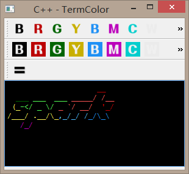

# TermColor

在某些情况下，我们会向终端中输出一些彩色字符或被格式修饰的字符，以通过对[figlet](http://www.figlet.org/)，[patorjk.com](http://patorjk.com/software/taag/)或其他命令做出的ASCII图形进行上色，可以显示在彩色终端中。

## 开发环境

> * C++/Qt 5.10.1
> * Python/PyQt 5.11.2 Based on Python 3.6.5

## 安装

可以选择期待的对应语言进行运行或编译运行，项目是基于QtSDK 5.10/5.11版本的，但可以使用5.7版本以上的库运行，更低版本还没有测试过。
请使用以下命令进行下载
```shell
git clone https://github.com/Ruilx/TermColor
```
之后cd进TermColor下的相应目录，然后选择相应目录进行操作

### Qt

使用qmake进行预构建，然后使用make进行构建
```shell
qmake
make qmake_all
```
之后使用'make'（或者使用MinGW的make 'mingw32-make'）进行编译
```shell
make -f Makefile.Release
```

### PyQt

使用Python 3.6+

首先遵循requirement.txt文件中的模块版本将所需模块进行安装或升级
```shell
pip install -r requirement.txt
```
完成之后直接使用python命令运行main.py即可
```shell
python main.py
```

## 当前支持的操作

- [x] 使用前景色进行渲染
- [x] 使用背景色进行渲染
- [x] 支持更亮的颜色
- [ ] 还未能支持粗体
- [ ] 还未能支持下划线
- [ ] 还未能支持闪烁
- [ ] emmmm...保存什么的

## 使用方法

在窗口上方书写或编辑文本，选择其中一部分可以选择工具栏中的颜色进行上色，完成之后点击'='开始转换，转换结果会放在下方。全选下方转换结果粘贴至终端`echo -e "..."`中即可在终端中看到编辑时候的样式。


### 当然还可以这么玩




（一些样式的正确打印还需要终端字体的支持）

emmmm...


## 当然...

这个项目的代码还有很多问题和未完善的地方，不过还是能解决一些燃眉之急的

如果感兴趣或发现什么问题的话请提交issue或pull request

好用的话记得点个右上角的星星哦